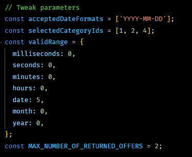

## Usage

Locate to root folder, install dependencies:

```
npm install
```


Mocking data by copying and pasting data into "./src/input.json". Note that the input data must be a valid JSON format or the program will stop and notify the error.

Before running the program, there are some parameters can be tweaked on top of "./src/index.js". The default values satisfy the requirements:



Run program to filter the best offers from input data, by specify check-in date in command line. For example:

```
npm start 2019-12-25
```

The result will be printed in the console and also can be found in "./src/output.json".

User can try different strategies for filtering and selecting that making the application highly flexible for customization. For example, an predefined "MaxDistMerchantPriorityStrategy" that only choose the merchant with the maximum distance of each offer.

Those filtering strategies following the practice of strategy design pattern. Because JS do not have interface, this source code uses parent classes as the interface for children classes to implement different strategies.
